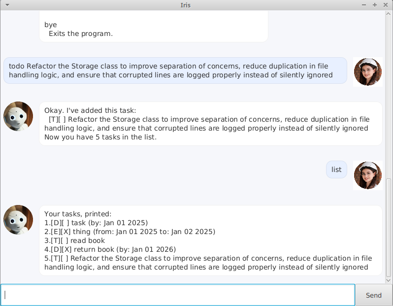

# Iris

Iris is a chatbot that helps you manage tasks from a chat interface.

## UI

## Quick Start

1. Ensure you have Java 17 installed.
2. Download the latest `iris.jar` from the release page.
3. Copy the jar into an empty folder.
4. Open a terminal in that folder and run:
   `java -jar iris.jar`
5. Type `help` on the chatbot for a list of commands and their formats.
6. Happy chatting!

## Data Storage

All tasks are automatically saved to:

`data/taskdata.txt`

This file is created in the same folder where the jar is executed.

##  Features overview (short)

## Features

- Add todos, deadlines, and events
- List tasks
- Mark tasks as done
- Delete tasks
- Data is saved automatically

## Commands

### Add a todo
Format: `todo DESCRIPTION`  
Example: `todo read book`

### Add a deadline
Format: `deadline DESCRIPTION /by YYYY-MM-DD`  
Example: `deadline submit iP /by 2026-02-28`

### Add an event
Format: `event DESCRIPTION /from YYYY-MM-DD /to YYYY-MM-DD`  
Example: `event camp /from 2026-03-01 /to 2026-03-03`

### List tasks
Format: `list`

### Mark done, unmark not done
Format:
- `mark INDEX`  
  Example: `mark 2`
- `unmark INDEX`  
  Example: `unmark 3`

### Delete
Format: `delete INDEX`  
Example: `delete 3`

### Exit
Format: `bye`

### Help
Format: `help`

## Constraints

- Dates must follow the `YYYY-MM-DD` format
- `INDEX` refers to the number shown in the `list` command (i.e. it's 1-indexed)

## Acknowledgements

- Robot image from [NDTV](https://www.ndtv.com/science/robots-might-be-able-to-sense-human-feelings-just-by-touching-skin-scientists-claim-7305948)
- User image from [Freepik](https://www.freepik.com/free-photos-vectors/young-professional-engineer)